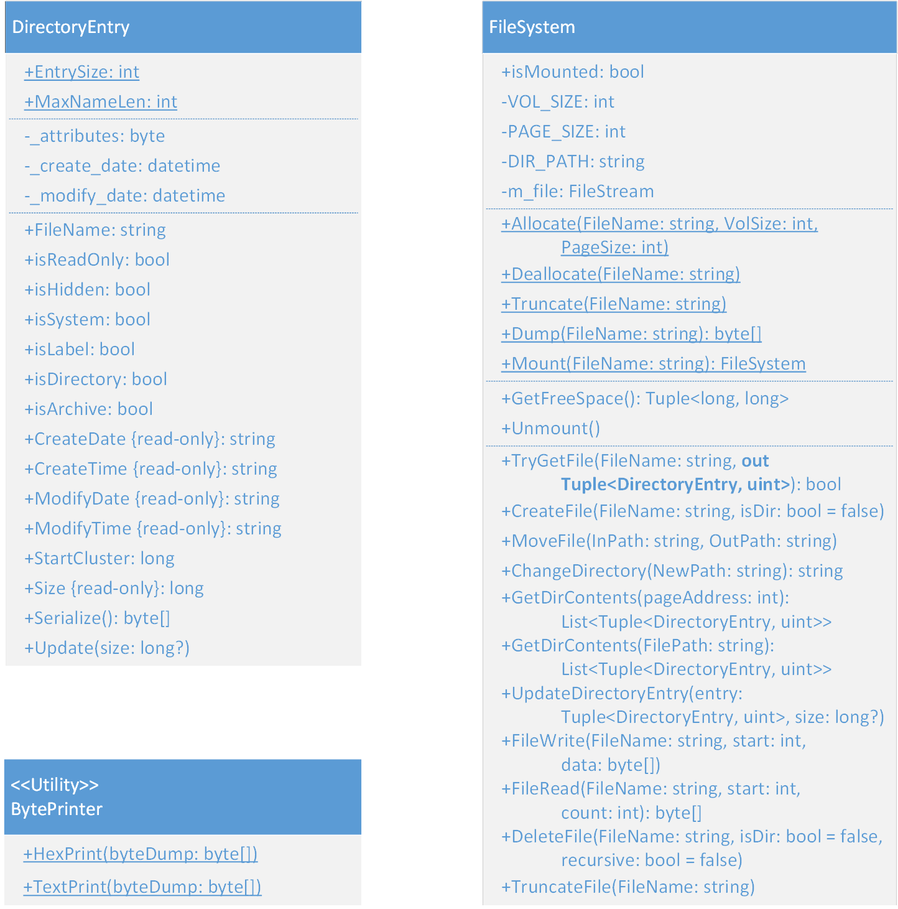

# FakeFS Design Document

## Overview

This program acts as a virtual file system that serializes program data to and from a file in local storage. Writing metadata to the file maintains the structure and integrity of the data and file hierarchy of the virtual filesystem. This implementation makes use of an organization method similar to that of the FAT filesystem, but differs in the specific data structures the metadata is composed from.

Every volume created by the virtual filesystem is a file within the same directory. When initially allocated, a volume will consist of the volume head, a file allocation table (FAT) page, a directory entry page for the root directory, and a number of null bytes equal to the size allocated. These volumes can be mounted using the virtual filesystem to interact with the contents using a command line interface that calls the filesystem APIs. An example of a newly allocated volume's values can be seen [here](FileSystemExample.md).

Files within a volume are represented by a directory entry object that is serializable to binary data structures written to the volume. These directory entries maintain the file's metadata and the address of the first FAT entry associated with the file. Directories within the root directory (or another directory, etc.) will have their own directory entry page appended to the volume that represents the contents of the directory. Directory entries are updated when a file's data or metadata has changed and written as a byte array inside its directory's entry page.

FAT entries indicate the status of a matching logical data cluster in the volume. The index of these FAT entries correspond to the index of the logical page the file's data is written to. If the file requires more than one cluster for its data, the FAT entry will indicate the location of the next FAT entry associated with the file. Otherwise, it will indicate that it is the file's last FAT entry.

## Source Structure

The _Program.cs_ source file contains all the main() function of `FakeFS.exe`. The metadata of DirectoryEntries and FileSystem APIs are manipulated from here by parsing user input to program actions. Static methods will run and then exit, except for `mount` which will provide an interactive command loop for the user. Mounted instance methods can only be run on mounted FileSystems. The test suite is also invoked from here by calling `FakeFS.exe`.

_DirectoryEntry.cs_ is an object file outlining the structure of directory entries and the methods that affect instances of them. The `set` command manipulates the attribute byte and `info` reads the metadata of DirectoryEntries directly by calling the mounted FileSystem's TryGetFile() Method.

_FileSystem.cs_ is an object file representing a virtual file system. The public methods on this object are called by main() in _Program.cs_ to perform interface actions. Static methods of the FileSystem class call file management operations of the operating system. Mounted instance methods perform reading and writing operations on the mounted volume. Several private methods also assist the public methods by providing interfaces that perform common actions:

- Write FileSystem related data structures to the volume.
- Read the contents of directories.
- Translate "logical" addresses into "physical" addresses.
- Translate file paths into addresses within the volume.
- Identify free clusters and directory entry blocks.

_BytePrinter.cs_ is an object file for a static utility class. The public methods on this class format byte arrays to human-readable output and prints that output to the terminal.
  

  

## FakeFS Interface

### Static Methods:

`FakeFS.exe Allocate <VolumeName> <VolumeSize> <PageSize>`

Creates a file with the name given in `<VolumeName>` with a size of `<VolumeSize>` and logical data pages that have a size of `<PageSize>`. This file will additionally have the volume head, a FAT page, and a directory entry page for the root directory written to it. The file size of the volume will always be larger than the allocated size because metadata storage is not counted as part of the volume's size. An example of a newly allocated volume's values can be seen [here](FileSystemExample.md).

`FakeFS.exe Deallocate <VolumeName>`

Deletes a file that matches the name given as `<VolumeName>`.

`FakeFS.exe Truncate <VolumeName>`

Reformats `<VolumeName>` to the default values as if it were newly allocated.

`FakeFS.exe Dump <VolumeName>`

Print the raw byte value of `<VolumeName>` as hex values.

`FakeFS.exe Mount <VolumeName>`

Opens a file that matches `<VolumeName>` and allows interaction with its files in the virtual filesystem. Remains mounted and with the command line in an interactive state until `exit` or `unmount` are input or the process is interrupted.

`FakeFS.exe Info <VolumeName>`

Prints the total size, free space, and files in `<VolumeName>`.
  

### Mounted Instance Methods:

Note regarding `<FileName>` and `<DirectoryName>`: Interface commands that accept filenames in this implementation can also receive absolute or relative file paths. Directories are files within the filesystem with the directory bit value set to true. These will have their own directory entry page that may also have directory entries and so on. By searching within the directory pages of directories, paths can be resolved comparing the path string to filenames starting from the root directory. If a file is not found for a given command where one was input, an error message is given and the user is returned to the interface prompt.

`Create <FileName>`

Creates a new directory entry with the name as `<FileName>` and allocates a free cluster to it. The size is 0 until something is written to it. This new directory entry is written to the page of the directory the file is created in.

`Mkdir <DirectoryName>`

Creates a new directory entry with the name set to `<DirectoryName>` and the directory attribute bit set to true. The start cluster value of the directory entry will indicate the address in the file that the directory entry page is written to.

`MV <InFileName> <OutFileName>`

Moves a file's directory entry from one location to another. If the file paths given are the same besides the filename, then the filename is just changed, and the directory entry is updated. If the directory path on the input and output file path differ, the directory entry is written to the `<OutFileName>`'s directory entry page and the directory entry for `<InFileName>`'s directory is zeroed out to indicate it is an empty slot for a new entry.

`CD | CD <DirectoryName>`

Changes the directory in the virtual filesystem the interface is currently pointing to. On drives that have just been mounted this will be the root directory. When a relative file path or bare file name is given, it is resolved from this location. When CD is entered without a `<DirectoryName>` argument it lists the current directory pointed to.

`Catalog | Catalog \&lt;Directory Name\&gt; [Aliases: LS, DIR]`

The directory entry page of `<DirectoryName>` is found and its contents are read. The results of this operation are printed to the screen.

`Write <FileName> <StartIndex> <Data>`

`<Data>` is written to the file given in `<FileName>`'s data from `<StartIndex>`. The address location in the volume is found from treating the logical pages allocated to the file as a byte array and `<Data>` is written as bytes to the array. The directory entry is updated with the new resulting size. If the `<StartIndex>` is greater than the file's size an error is thrown.

`Read <FileName> <StartIndex> <Count>`

Read the byte values of `<FileName>` from `<StartIndex>` for `<Count>` bytes. The address location in the volume is found from treating the logical pages allocated to the file as a byte array. Bytes are converted to ASCII characters before being printed to the screen.

`Delete <FileName>`

`<FileName>`'s directory entry is zeroed to indicate that it is a free entry. Additionally, all clusters associated with the file are zeroed to indicate that they are free clusters.

`RmDir <DirectoryName>`

`<DirectoryName>`'s directory entry is zeroed to indicate that it is a free entry. Additionally, the directory entry page for the directory is removed from the volume.

`Truncate <FileName>`

Zeroes `FileName>`'s FAT entries except for the first cluster, sets its size to 0, and updates its directory entry.

`Info <FileName>`

Prints the size, file attributes, creation time, and last modified time of `<FileName>`.

`Set | Set <FileName> <Attribute>=[True || False]`

Sets `<Attribute>` of `<FileName>`'s attribute byte to the value input and updates its directory entry. If invoked without arguments, it prints the attribute byte of all folder contents.
